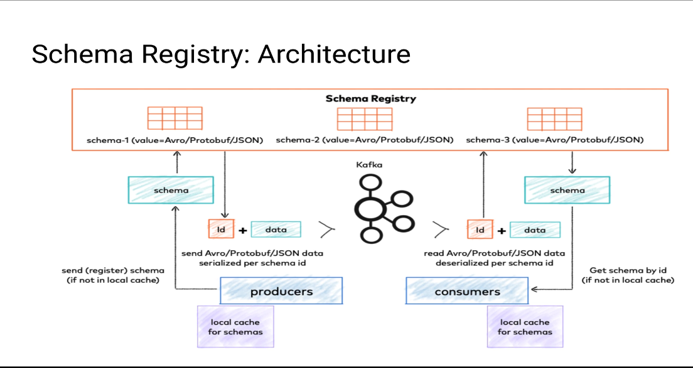

# debezium

Stream changes from your database

## Architecture

- https://debezium.io/documentation/reference/3.0/architecture.html

## Kafka Connect

- https://kafka.apache.org/documentation/#connect

## Data Contract

- https://docs.confluent.io/platform/current/schema-registry/fundamentals/data-contracts.html

## Schema Registry (Data Governance)

- https://docs.confluent.io/platform/current/schema-registry/index.html
- https://www.redpanda.com/guides/kafka-tutorial-kafka-schema-registry

## Oportunities

Schema registry CI/CD

## Reference

- https://debezium.io/
- https://kai-waehner.medium.com/data-governance-for-apache-kafka-with-schema-registry-and-data-contracts-62b65baf56e7
